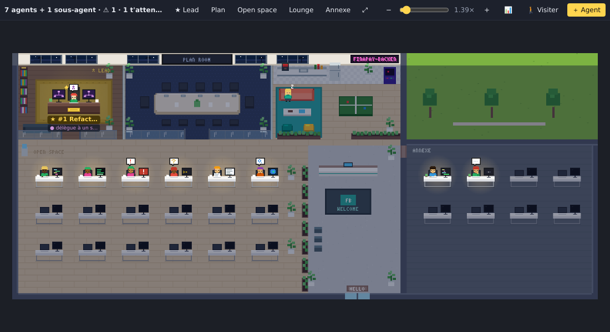

# Real Pixel Agent

Un campus en pixel art dans VS Code, façon bureaux de la Silicon Valley : chaque session Claude Code active est un personnage qui travaille, se déplace et se réunit selon ce qu'il fait réellement.



## Installation

Télécharge le `.vsix` de la dernière [release](https://github.com/aymardkouakou/real-pixel-agent/releases), puis :

```bash
code --install-extension real-pixel-agent-0.4.0.vsix
```

Panneau du bas → onglet **Real Pixel Agent**, ou commande **Real Pixel Agent : Ouvrir le campus dans un onglet**.

Au premier lancement, l'extension propose d'**installer les hooks Claude Code**. C'est recommandé : le suivi devient exact. Commande équivalente : **Real Pixel Agent : Installer les hooks Claude Code**. Relance ensuite tes sessions Claude Code déjà ouvertes.

## Suivi exact ou estimé

| | Sans hooks (estimé) | Avec hooks (exact) |
|---|---|---|
| Source | transcriptions `~/.claude/projects/**.jsonl` | + événements `PreToolUse`, `PermissionRequest`, `Stop`, `SessionEnd`… |
| Demande de permission | outil sans résultat après 8 s (une longue compilation peut apparaître en rouge) | événement `PermissionRequest` / notification de permission |
| Mode plan | rappels système dans la transcription | champ `permission_mode` de chaque événement |
| Fin de session | après 20 min d'inactivité | immédiate (`SessionEnd`) |
| Bouton « Terminal » | seulement pour les agents lancés via « ＋ Agent » | tout agent lancé dans un terminal VS Code (par PID) |

Les hooks sont des commandes **asynchrones** ajoutées à `~/.claude/settings.json` (une sauvegarde `settings.json.real-pixel-agent.bak` est créée) :
- elles ne bloquent pas Claude et n'écrivent rien sur la sortie standard ;
- elles enregistrent un résumé de chaque événement dans `~/.real-pixel-agent/events/` : nom de l'outil, fichier, description, pas de contenu de fichier ;
- tes autres hooks ne sont pas touchés ;
- la commande **Retirer les hooks Claude Code** rend le fichier dans son état d'origine.

## Le campus

| Zone | Qui y est |
|---|---|
| **Bureau du lead** | l'agent principal, avec étoile dorée et halo ; « ★ Lead » dans la fiche d'un agent pour en choisir un autre |
| **Open space** | les autres agents ; les sous-agents s'installent près de leur parent et portent sa couleur |
| **Salle de plan** | dès qu'un plan est en rédaction, les agents s'y réunissent (kanban animé à l'écran) |
| **Lounge** | les agents en pause viennent s'y reposer |
| **Annexe** | avec `showOtherWorkspaces`, les agents de tes autres projets, dans un bâtiment voisin |
| **Réception** | entrées et sorties par la porte vitrée |

Ambiance jour, coucher de soleil ou nuit avec lampes de bureau, selon l'heure ou forcée (`timeOfDay`).

## Navigation

| Action | Effet |
|---|---|
| Glisser (gauche, milieu ou droit) | se déplacer, avec élan au relâcher |
| Molette · pincement · curseur · `+` `−` `0` | zoom continu 0,35×–10×, net à tout niveau |
| Double-clic dans le vide (`Maj` : inverse) | zoom ×2 sur ce point |
| Double-clic sur un agent | la caméra le suit |
| `F` · `L` · `P` · boutons de zones | tout voir · lead · salle de plan · zones |
| `V` ou « 🚶 Visiter » | ton avatar au clavier ; la fiche de l'agent le plus proche s'ouvre |
| `J` ou 📊 | journal de la journée |
| Minimap | cliquer ou glisser pour s'y rendre |

Fiche d'un agent (clic) : suivre, renommer, changer d'apparence (🎲, `Maj` + clic pour revenir à l'origine), nommer lead, ouvrir la transcription, aller au terminal.

## Journal

Temps passé par agent et par état, jour par jour sur 7 jours, avec indicateurs : temps agents, travail effectif, temps à t'attendre. Export CSV via le bouton du panneau ou la commande **Exporter le journal (CSV)**.

## Réglages

| Clé | Défaut | Rôle |
|---|---|---|
| `realPixelAgent.useHooks` | `true` | utiliser les hooks quand ils sont installés |
| `realPixelAgent.meetingMode` | `all` | `all` : tous les agents actifs en réunion ; `team` : l'équipe qui planifie |
| `realPixelAgent.onlyCurrentWorkspace` | `true` | sessions du workspace ouvert uniquement |
| `realPixelAgent.showOtherWorkspaces` | `false` | les autres projets dans l'annexe |
| `realPixelAgent.renderer` | `pixel` | `pixel` : pixel art 2D ; `3d` : rendu 3D **expérimental** (voir ci-dessous) |
| `realPixelAgent.timeOfDay` | `auto` | `auto`, `day`, `sunset`, `night` |
| `realPixelAgent.sound` | `true` | bip à chaque nouvelle demande de permission |
| `realPixelAgent.notifyOnPermission` | `true` | notification quand le campus n'est pas visible |
| `realPixelAgent.activeWindowMinutes` | `20` | inactivité avant de quitter le campus |
| `realPixelAgent.permissionDelaySeconds` | `8` | seuil de l'estimation (sans hooks) |
| `realPixelAgent.scale` | `3` | zoom initial |
| `realPixelAgent.claudeCommand` | `claude` | commande du bouton « ＋ Agent » |
| `realPixelAgent.projectsDir` | (vide) | dossier des transcriptions si non standard |

## Rendu 3D (expérimental)

> ⚠️ **Fonctionnalité expérimentale.** Le rendu 3D (Three.js) est en cours de développement : l'apparence, les commandes et les performances peuvent encore changer, et certaines fonctions du rendu pixel peuvent y manquer ou différer. Le rendu **pixel 2D reste le mode par défaut** et le mode de référence.

Activation : `"realPixelAgent.renderer": "3d"` dans les réglages ; la vue se recharge aussitôt. Pour revenir au pixel art, remets `"pixel"`. Souris : glisser pour tourner, clic droit pour se déplacer, molette pour zoomer.

### Matériel recommandé

Le rendu 3D utilise WebGL 2 avec ombres, anti-crénelage et éclairage dynamique ; il sollicite le GPU en continu tant que la vue est visible. Ces valeurs sont indicatives (pas de mesures sur toutes les configurations) :

| | Minimum (utilisable) | Recommandé (fluide) |
|---|---|---|
| **GPU** | graphique intégré récent (Intel Iris Xe, Apple M1, AMD Vega) | GPU dédié ou Apple Silicon M1 Pro et plus (NVIDIA GTX 1650 / RTX, AMD RX 5000+) |
| **Mémoire** | 8 Go de RAM | 16 Go de RAM |
| **Processeur** | 4 cœurs | 6 cœurs ou plus |
| **Écran** | 1080p | 1440p / 4K ou Retina : la résolution est plafonnée à ×2, mais un écran dense demande un GPU dédié |
| **Pilotes / VS Code** | VS Code ≥ 1.85, accélération matérielle activée | pilotes graphiques à jour |

Pour rester fluide :
- **Garde l'accélération matérielle** activée (VS Code : `"disable-hardware-acceleration"` ne doit pas être défini dans `argv.json`). Sans GPU, le rendu logiciel est très lent : reste alors en `pixel`.
- Sur portable, **branche le secteur** : la 3D est plus gourmande que le pixel art, surtout avec beaucoup d'agents ou un écran 4K.
- **Cache la vue** quand tu ne la regardes pas : le rendu s'arrête quand l'onglet est caché.
- Pas de WebGL 2 (machine très ancienne, session distante sans GPU, SSH / conteneur) : utilise `pixel`.

## Performances

- **Fichiers** : surveillance des dossiers (réaction immédiate), avec un scan de secours toutes les 5 s. Chaque seconde, les états sont réévalués sans aucune lecture disque.
- **Transcriptions** : lecture incrémentale, seuls les octets ajoutés sont lus. Seules les 400 dernières entrées, résumées, sont gardées en mémoire.
- **Rendu** : seule la zone visible est redessinée. 60 images/s quand quelque chose bouge, environ 20 images/s au repos, et rien quand l'onglet est caché.

## Développement

Node 20 requis (`nvm use` lit `.nvmrc`). F5 dans VS Code compile puis lance l'extension dans une fenêtre de développement.

```bash
npm install
npm run compile        # TypeScript + assemblage du webview (media/src -> media/main.js)
npm test               # scanner, hooks, journal, test de fumée de l'extension
npm run test:render    # captures comparées aux références (UPDATE_SNAPSHOTS=1 pour régénérer)
npm run package        # .vsix
```

| Chemin | Contenu |
|---|---|
| `src/scanner.ts` | transcriptions : lecture incrémentale, calcul des états, fusion des hooks |
| `src/hooks.ts` | installation dans `settings.json`, lecture des événements |
| `src/journal.ts` | temps par agent et par état |
| `src/extension.ts` | vue, commandes, surveillance de fichiers, barre d'état, notifications |
| `hook/real-pixel-agent-hook.js` | script exécuté par Claude Code (aucune dépendance) |
| `media/src/00…90-*.js` | webview : noyau, carte, écrans, personnages, chemins (A*), acteurs, rendu, caméra, interface, extras |
| `.github/workflows/ci.yml` | tests, tests de rendu, paquet `.vsix`, publication sur les tags `v*` |

## Publier une version

1. Commite tes changements (l'arbre git doit être propre).
2. Lance `npm run package` (ou `npm run package -- minor`, `major`, `x.y.z`). La commande :
   - ajoute une section `## x.y.z` en tête de `CHANGELOG.md` à partir des commits depuis la dernière version (si la section existe déjà, elle est conservée), et la commite ;
   - met à jour la version dans `package.json` / `package-lock.json` et commite « Version x.y.z » ;
   - construit le `.vsix`.
   Relis la section ajoutée au CHANGELOG ; pour la corriger, amende le commit « Changelog x.y.z » avant de pousser. `--dry-run` montre la version et la section sans rien modifier.
3. Pousse `main` (`git push origin main`, ou ajoute `--push` à l'étape 2). Sur `main`, la CI :
   - lance les tests et construit le `.vsix` ;
   - si la version du `package.json` n'a pas encore de release, crée le tag `vx.y.z` et publie la release GitHub, avec les notes du CHANGELOG et le `.vsix` en pièce jointe.

`npm run package:dev` construit un `.vsix` de test sans toucher à la version ni au CHANGELOG. `npm run release -- <version>` reste disponible pour n'exécuter que l'étape de version.

Le bouton « Run workflow » de l'onglet Actions relance cette publication. Pousser soi-même un tag `vx.y.z` fonctionne aussi : la CI vérifie alors qu'il correspond au `package.json`.
